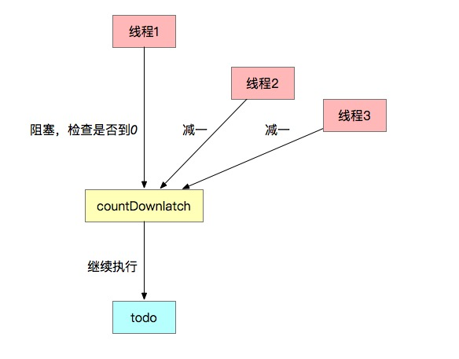
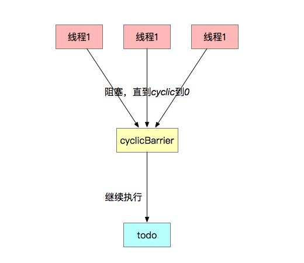
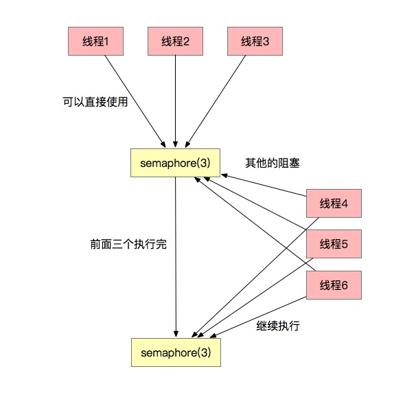

#计数器

##  CountDownLatch
*CountDownLatch可以实现多线程之间的计数器，并实现阻塞功能。比如某个任务依赖于其他的两个任务，只有那两个任务执行结束后，它才能执行。*
## 图例：

##CyclicBarrier 循环栅栏
*它有两层含义，一个是栅栏，一个是循环。先看栅栏，意思就是想一堵墙一样，可以同时对多个线程状态进行管理。*
## 图例：

##Semaphore信号量
*这个东西有点像连接池的感觉，某一时间只有几个线程能拿到资源，执行操作。*
## 图例：

###总结
    1. CountDownLatch 可以实现计数等待，主要用于某个线程等待其他几个线程
    2. CyclicBarrier 实现循环栅栏，主要用于多个线程同时等待其他线程
    3. Semaphore 信号量，主要强调只有某些个数量的线程能拿到资源执行